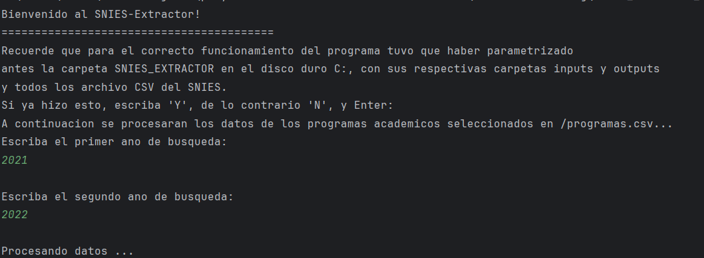
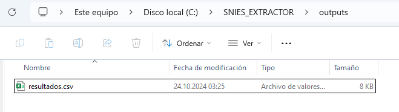
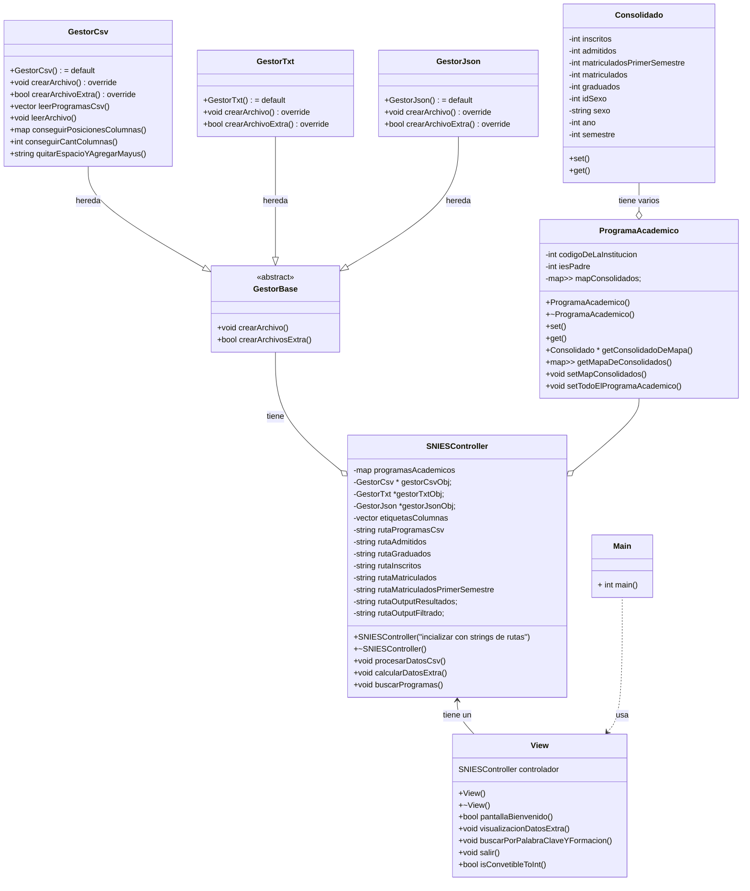

## SNIES Extractor
Gracias al grupo que me presetó el código fuente de este proyecto

## Presentación general
En este proyecto se utiliza 8 clases para cumplir el propósito de extraer la información del Sistema Nacional de Información de Educación Superior. Para el usuario, este tendrá una interfaz por terminal que le indicará los pasos a seguir y la información que necesita digitar.

## Cumplimiento de Requerimientos

1. **Solicitar rango de años a analizar**  
   En el menú, se le pregunta al usuario el rango de años de búsqueda.

2. **Lectura de archivos .csv correspondientes**  
   A partir de los años ingresados por el usuario, el controlador (clase `SNIESController`) leerá la información de los archivos apropiados uno por uno.

3. **Calcular admitidos, inscritos, graduados, matriculados y matriculados de primer semestre por programa y por año**  
   El SNIES-Extractor, mediante su controlador, leerá estos datos en los archivos correspondientes y en los años de búsqueda solicitados

4. **Generación de Archivos de Salida**  
   Al terminar de extraer la información y procesarla, el SNIES-Extractor generará un archivo de resultados en la siguiente carpeta que ya debería estar parametrizada en el disco duro:  
   `C:\SNIES_EXTRACTOR\outputs\resultados.csv`.

5. **Visualización de Datos**  
   **(PENDIENTE)** El SNIES-Extractor muestra al usuario el consolidado de estudiantes por año en programas presenciales o virtuales, la diferencia porcentual anual entre la cantidad de nuevos matriculados durante los años de búsqueda por programa y la lista de programas sin nuevos matriculados en 3 semestres consecutivos. Además, permitirá al usuario exportar esta información en un archivo ubicado en la carpeta ya parametrizada:  
   `C:\SNIES_EXTRACTOR\outputs\extras.csv`.

6. **Filtrado de Programas**  
   Se le pregunta al usuario si desea hacer una búsqueda con 2 filtros entre los programas solicitados: una palabra clave para buscar según los nombres de programas y el nivel de formación de los programas.

7. **Validación de Datos**  
   El SNIES-Extractor es un programa de C++ robusto que puede detectar errores a la hora de recibir información fuera de rangos esperados, tanto de parte del usuario como de la lectura de los archivos .csv.

## **MEJORAS FUNCIONALES**
1. El programa soporta cualquier tamaño de archivos gracias a funciones de lectura y almacenamiento de las posiciones de las columnas
2. El programa soporta cualquier rango de años. Solo debe tener en la carpeta de inputs los archivos en los que se desesa buscar.

En este caso, los datos de _ADMITIDOS_ del 2023 están en blanco ya que el archivo admitidos2023.csv tiene en la columna de años, en vez de un 2023, tiene un 2021. Esto hace que el consolidado se guarde en el correspondiente año (en 2021) 
Por lo tanto, para el correcto funcionamiento del código, las columnas deben estar bien hechas.

3. El sistema genera archivos únicamente archivos CSV. TXT y JSON aún no están oganizados para que funcionen con el mapa de Consolidados.
4. (RECOMENDACIÓN) El programa usa mapas en vez de vectores e índices para ubicarse. Se ubican gracias a las claves y los nombres que se guardan en los mapas.
5. El delimitador de caracteres puede cambiar fácilmente ya que se ubica en settings.

# Diagrama Mermaid

